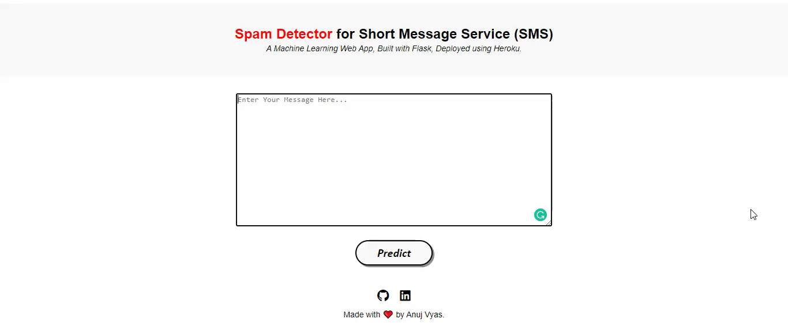

# Spam SMS Classification - Deployment

• This repository consists of files required to deploy a ___Machine Learning Web App___ created with ___Flask___ on ___Heroku___ platform.

• If you want to view the deployed model, click on the following link: 
Deployed at: _https://spam-sms-detector.herokuapp.com/_

• A glimpse of the web app:

